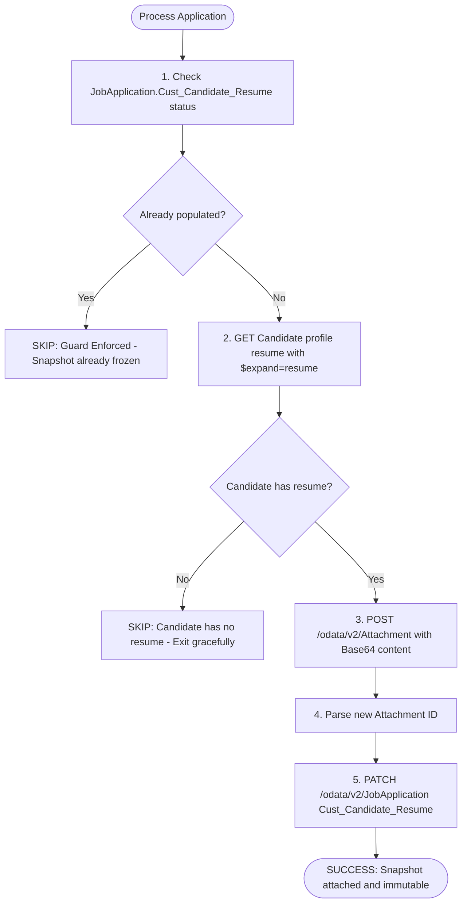

# SAP SuccessFactors Recruiting — Candidate Resume Snapshot to Job Application Integration

[](https://www.python.org/downloads/)
[](https://www.odata.org/documentation/odata-version-2-0/)
[]()

## Overview & Architecture

In SAP SuccessFactors Recruiting:
- The `Candidate` profile's `resume` field is a **floating pointer** (representing the candidate's latest, globally uploaded resume).
- Each `JobApplication`'s custom attachment field (`Cust_Candidate_Resume`) must represent a **frozen, write-once audit snapshot** taken at the time that specific application was first processed.

This integration executes the guarded snapshot copy logic adhering strictly to the non-negotiable write-once rule.

### Process Flow



---

## Key Modules & Function Signatures

All core functions are implemented in [`sf_client.py`](file:///Users/vanshajsharma/MoveResume/sf_client.py):

| Function | Purpose |
|---|---|
| `get_candidate_resume(candidate_id, client=None)` | Queries Candidate entity with `$expand=resume` and extracts Base64 `fileContent`. Returns `None` gracefully if resume is empty/absent. |
| `get_application_snapshot_status(app_id, client=None)` | Evaluates `JobApplication.Cust_Candidate_Resume` to enforce the write-once guard. |
| `upload_attachment(base64_content, filename, module="RECRUITING", client=None)` | Creates a new independent `Attachment` object in SuccessFactors and returns the clean Attachment ID. |
| `update_application_snapshot(app_id, attachment_id, client=None)` | Links the new attachment to `JobApplication.Cust_Candidate_Resume` via `PATCH` (with `MERGE`/`upsert` fallback). |
| `orchestrate_resume_snapshot(candidate_id, app_id, client=None)` | Orchestrates the entire guarded copy lifecycle for a single application. |

---

## Test Case Reference

| Attribute | Value |
|---|---|
| **Candidate ID** | `1104827` (`kavitap@yopmail.com`) |
| **Job Requisition ID** | `28997` |
| **Job Application ID** | `547901` |
| **Environment** | `https://api44preview.sapsf.com` |
| **Source Field** | `Candidate.resume` |
| **Target Field** | `JobApplication.Cust_Candidate_Resume` |

---

## Running the Integration & Tests

### 1. Install Dependencies
```bash
pip install -r requirements.txt
```

### 2. Configure Environment (Optional for Live Execution)
Copy `.env.example` to `.env` and configure your API credentials:
```bash
cp .env.example .env
```

### 3. Run Automated Unit & Integration Tests
```bash
pytest test_integration.py -v
```

### 4. Execute CLI Runner
```bash
# Execute test case against instance
python main.py --candidate-id 1104827 --application-id 547901

# Inspect live tenant $metadata for field validation
python main.py --inspect-metadata
```
