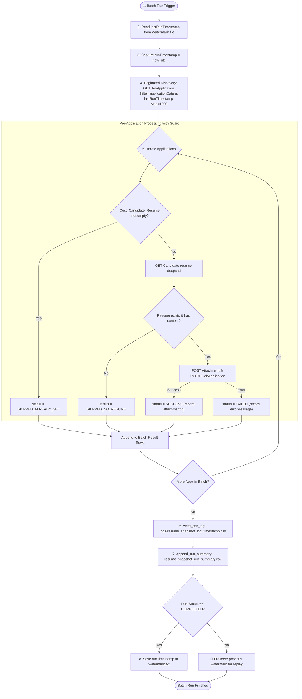

# SF_Resume_Move: SAP SuccessFactors Recruiting — Candidate Resume Snapshot Integration (Phase 1 & Phase 2)

[](https://www.python.org/downloads/)
[](https://www.odata.org/documentation/odata-version-2-0/)
[]()

Enterprise batch integration for **SAP SuccessFactors Recruiting** that copies a candidate's resume from their Candidate Profile to a custom attachment field on their Job Applications, enforcing an immutable **write-once snapshot** across single-application testing and multi-application scheduled batch runs.

---

## Business Rule (Non-Negotiable)

The `Cust_Candidate_Resume` field on a `JobApplication` is **write-once**:
- **If empty** $\rightarrow$ Populate with the resume currently on the Candidate Profile at processing time.
- **If already populated** $\rightarrow$ **Never modify or overwrite it**, preserving the historical audit trail even after the candidate updates their profile resume.
- **Floating Pointer vs. Frozen Snapshot**: The Candidate Profile's `resume` is a dynamic, floating pointer (always latest), whereas each Job Application's `Cust_Candidate_Resume` is a frozen snapshot taken at first-processing time.

---

## Entity & Field Mapping

| Entity | Field | Role | Type | Description |
|---|---|---|---|---|
| `Candidate` | `resume` | Source | Standard Navigation Property | Current resume on candidate profile (`fileContent`, `fileName`) |
| `JobApplication` | `Cust_Candidate_Resume` | Target | Custom Attachment Field / Nav | Immutable snapshot linked to the job application |
| `JobApplication` | `applicationDate` | Discovery | DateTime / DateTimeOffset | Timestamp used for delta watermark discovery |
| `Attachment` | `fileContent` / `attachmentContent` | Entity | OData Attachment Object | Cloned independent attachment created via API |

---

## Architecture & Process Flow



---

## Watermark & Delta Discovery Mechanics

- **Polling Trigger**: Scheduled hourly cron / batch execution.
- **Delta Discovery Query**:
  ```http
  GET /odata/v2/JobApplication
      ?$filter=applicationDate gt datetimeoffset'{lastRunTimestamp}'
      &$select=applicationId,candidateId,Cust_Candidate_Resume
      &$top=1000&$skip={n}
  ```
  *(Pages with `$top=1000&$skip={n}` until an empty result set is returned).*
- **Watermark Advance Safety**:
  - The watermark is updated with the run's **start timestamp** (`runTimestamp`) **only** when the batch run finishes with status `COMPLETED`.
  - If a fatal run failure occurs (`ERRORED`), the watermark is **never advanced**, ensuring subsequent runs safely re-cover the window without data loss.
  - Because `Cust_Candidate_Resume` enforces the write-once guard (`SKIPPED_ALREADY_SET`), reprocessing overlapping windows is 100% idempotent.

---

## CSV Auditing & Logging Specifications

### 1. Per-Run CSV Log: `logs/resume_snapshot_log_{runTimestamp}.csv`
Created for every batch execution (one row per processed application):

| Column | Description |
|---|---|
| `runTimestamp` | UTC start time of the batch run |
| `applicationId` | Job application ID processed |
| `candidateId` | Candidate ID associated with the application |
| `status` | `SUCCESS`, `SKIPPED_ALREADY_SET`, `SKIPPED_NO_RESUME`, `FAILED` |
| `attachmentId` | Newly cloned attachment ID (populated only on `SUCCESS`) |
| `errorMessage` | Error message string (populated only on `FAILED`) |

### 2. Cumulative Run Summary: `resume_snapshot_run_summary.csv`
Appended to on each run to track high-level batch health over time:

| Column | Description |
|---|---|
| `runTimestamp` | UTC start time of the batch run |
| `applicationsFound` | Total applications discovered in this window |
| `succeeded` | Count of `SUCCESS` |
| `skippedAlreadySet` | Count of `SKIPPED_ALREADY_SET` |
| `skippedNoResume` | Count of `SKIPPED_NO_RESUME` |
| `failed` | Count of `FAILED` |
| `runStatus` | `COMPLETED` or `ERRORED` |

---

## Setup & Configuration

### 1. Installation
```bash
git clone https://github.com/vanshaj8/SF_Resume_Move.git
cd SF_Resume_Move
pip install -r requirements.txt
```

### 2. Configure Credentials (`.env`)
Create a `.env` file in the project root:
```bash
cp .env.example .env
```
Configure your credentials:
```env
SF_API_BASE_URL=https://api44preview.sapsf.com
SF_COMPANY_ID=your_company_id
SF_USERNAME=your_api_username
SF_PASSWORD=your_api_password
```

---

## Demo Run Scenarios & Output Examples

Below are concrete execution examples and expected outputs for every operational scenario:

### Scenario 1: Scheduled Batch Run (Phase 2 Default)
Discovers all applications created/modified since the last watermark, enforces write-once guards, clones attachments, updates watermarks, and writes CSV logs.

**Command:**
```bash
python3 main.py --batch
```

**Example Terminal Output:**
```text
==============================================================================
SAP SuccessFactors Recruiting: Candidate Resume Snapshot Integration
==============================================================================
Environment:       https://api44preview.sapsf.com
Target Field:      Cust_Candidate_Resume
Mode:              Scheduled Batch Discovery & Processing
Watermark File:    watermark.txt
==============================================================================

[Action] Executing Batch Engine...
[2026-08-25 14:00:00] [INFO] [sf_resume_snapshot]: === Starting Batch Integration Run at 2026-08-25T14:00:00Z ===
[2026-08-25 14:00:00] [INFO] [sf_resume_snapshot]: Processing window: applicationDate > 2026-08-25T13:00:00Z
[2026-08-25 14:00:01] [INFO] [sf_resume_snapshot]: Discovered 4 applications in current page (Total so far: 4)
[2026-08-25 14:00:02] [INFO] [sf_resume_snapshot]: Successfully created and linked snapshot attachment 98231 to JobApplication 547901
[2026-08-25 14:00:02] [INFO] [sf_resume_snapshot]: JobApplication 547902 already has Cust_Candidate_Resume set (Attachment ID: 88120). Skipping.
[2026-08-25 14:00:03] [INFO] [sf_resume_snapshot]: Candidate 1104829 has no resume. Skipping JobApplication 547903.
[2026-08-25 14:00:04] [INFO] [sf_resume_snapshot]: Batch run COMPLETED successfully. Watermark advanced to 2026-08-25T14:00:00Z

==============================================================================
Batch Run Summary:
==============================================================================
{
  "runTimestamp": "2026-08-25T14:00:00Z",
  "applicationsFound": 4,
  "succeeded": 1,
  "skippedAlreadySet": 1,
  "skippedNoResume": 1,
  "failed": 1,
  "runStatus": "COMPLETED",
  "csvLogPath": "logs/resume_snapshot_log_2026-08-25T14-00-00Z.csv",
  "summaryFilePath": "resume_snapshot_run_summary.csv",
  "watermarkAdvanced": true
}

✅ Batch run completed. Log written to: logs/resume_snapshot_log_2026-08-25T14-00-00Z.csv
```

**Generated Per-Run CSV Log (`logs/resume_snapshot_log_2026-08-25T14-00-00Z.csv`):**
```csv
runTimestamp,applicationId,candidateId,status,attachmentId,errorMessage
2026-08-25T14:00:00Z,547901,1104827,SUCCESS,98231,
2026-08-25T14:00:00Z,547902,1104828,SKIPPED_ALREADY_SET,,
2026-08-25T14:00:00Z,547903,1104829,SKIPPED_NO_RESUME,,
2026-08-25T14:00:00Z,547904,1104830,FAILED,,HTTP 500: Attachment upload failed
```

**Cumulative Run Summary (`resume_snapshot_run_summary.csv`):**
```csv
runTimestamp,applicationsFound,succeeded,skippedAlreadySet,skippedNoResume,failed,runStatus
2026-08-25T13:00:00Z,10,6,2,2,0,COMPLETED
2026-08-25T14:00:00Z,4,1,1,1,1,COMPLETED
```

---

### Scenario 2: Single Application Test (Phase 1 Test Case)
Runs the guarded copy for a single Candidate and Job Application pair.

**Command:**
```bash
python3 main.py --single --candidate-id 1104827 --application-id 547901
```

**Example Output (New Snapshot Created):**
```text
==============================================================================
SAP SuccessFactors Recruiting: Candidate Resume Snapshot Integration
==============================================================================
Environment:       https://api44preview.sapsf.com
Target Field:      Cust_Candidate_Resume
Mode:              Single Application Test
Candidate ID:      1104827
Job Application ID:547901
==============================================================================

[Action] Running Guarded Resume Snapshot for single application...
[2026-08-25 14:05:00] [INFO] [sf_resume_snapshot]: Application 547901 Snapshot Status: is_populated=False, current_attachment_id=None
[2026-08-25 14:05:01] [INFO] [sf_resume_snapshot]: Found Candidate resume: fileName='Kavita_Resume.pdf', size=154200 base64 chars
[2026-08-25 14:05:02] [INFO] [sf_resume_snapshot]: Successfully created Attachment with plain ID: 98231
[2026-08-25 14:05:03] [INFO] [sf_resume_snapshot]: Successfully linked Attachment 98231 to JobApplication 547901

==============================================================================
Execution Result Summary:
==============================================================================
{
  "status": "SUCCESS",
  "message": "Successfully captured resume snapshot from Candidate 1104827 and linked Attachment 98231 to JobApplication 547901.",
  "application_id": "547901",
  "candidate_id": "1104827",
  "attachment_id": "98231",
  "filename": "Snapshot_App_547901_Kavita_Resume.pdf"
}

✅ Resume snapshot successfully cloned and attached to Job Application.
```

**Example Output (When Write-Once Guard Triggers on Re-Run):**
```text
==============================================================================
Execution Result Summary:
==============================================================================
{
  "status": "SKIPPED_ALREADY_EXISTS",
  "message": "Write-once guard triggered: JobApplication 547901 already has a frozen snapshot linked (Attachment ID: 98231). Preserving existing snapshot without overwrite.",
  "application_id": "547901",
  "candidate_id": "1104827",
  "attachment_id": "98231"
}

ℹ️  Process completed safely (SKIPPED_ALREADY_EXISTS): Write-once guard triggered
```

---

### Scenario 3: Batch Run with Custom Lookback Date (`--since`)
Allows manually specifying the discovery timestamp rather than reading from `watermark.txt`.

**Command:**
```bash
python3 main.py --since 2026-08-25T00:00:00Z
```

**Example Terminal Output:**
```text
==============================================================================
SAP SuccessFactors Recruiting: Candidate Resume Snapshot Integration
==============================================================================
Environment:       https://api44preview.sapsf.com
Target Field:      Cust_Candidate_Resume
Mode:              Scheduled Batch Discovery & Processing
Watermark File:    watermark.txt
Lookback Override: 2026-08-25T00:00:00Z
==============================================================================

[Action] Executing Batch Engine...
[2026-08-25 14:10:00] [INFO] [sf_resume_snapshot]: Processing window: applicationDate > 2026-08-25T00:00:00Z
[2026-08-25 14:10:02] [INFO] [sf_resume_snapshot]: Discovered 12 applications to process.
```

---

### Scenario 4: Live Tenant Schema Inspection (`--inspect-metadata`)
Queries `$metadata` to verify attachment payload fields and custom resume field names.

**Command:**
```bash
python3 main.py --inspect-metadata
```

**Example Output:**
```json
{
  "attachment_content_field": "fileContent",
  "target_field_present": true,
  "raw_metadata_length": 845210
}
```

---

### Scenario 5: Automated Unit & Integration Tests
Runs all 16 mocked unit and integration tests covering positive flows, write-once skips, pagination, and error isolation.

**Command:**
```bash
pytest test_integration.py -v
```

**Example Output:**
```text
============================= test session starts ==============================
platform darwin -- Python 3.12.2, pytest-9.1.1
rootdir: /Users/vanshajsharma/MoveResume
collected 16 items

test_integration.py::test_parse_attachment_id_variations PASSED          [  6%]
test_integration.py::test_parse_attachment_id_invalid PASSED             [ 12%]
test_integration.py::test_get_candidate_resume_success PASSED            [ 18%]
test_integration.py::test_get_candidate_resume_no_resume PASSED          [ 25%]
test_integration.py::test_upload_attachment_success PASSED               [ 31%]
test_integration.py::test_update_application_snapshot_success PASSED     [ 37%]
test_integration.py::test_discover_applications_paginated PASSED         [ 43%]
test_integration.py::test_process_application_skipped_already_set PASSED [ 50%]
test_integration.py::test_process_application_skipped_no_resume PASSED   [ 56%]
test_integration.py::test_process_application_success PASSED             [ 62%]
test_integration.py::test_process_application_failed_error_isolation PASSED [ 68%]
test_integration.py::test_write_csv_log PASSED                           [ 75%]
test_integration.py::test_append_run_summary PASSED                      [ 81%]
test_integration.py::test_watermark_lifecycle PASSED                     [ 87%]
test_integration.py::test_run_batch_advances_watermark_on_completed PASSED [ 93%]
test_integration.py::test_run_batch_preserves_watermark_on_errored PASSED [100%]

============================== 16 passed in 0.18s ==============================
```

---

## Python API & Function Reference

```python
from sf_client import (
    run,
    discover_applications,
    process_application,
    orchestrate_resume_snapshot,
    get_candidate_resume,
    upload_attachment,
    update_application_snapshot,
    SFClient,
)

# 1. Execute full batch integration pipeline
batch_summary = run(watermark_file="watermark.txt")
print(batch_summary)

# 2. Or process single application
single_result = orchestrate_resume_snapshot(candidate_id="1104827", app_id="547901")
print(single_result)
```

| Function | Signature | Purpose |
|---|---|---|
| `run` | `(client=None, watermark_file="watermark.txt", log_dir="logs", summary_file="...") -> dict` | Full Phase 2 batch orchestrator with watermark and CSV log creation. |
| `discover_applications` | `(last_run_timestamp, client=None, page_size=1000) -> list[dict]` | Paginated discovery of JobApplications created since watermark. |
| `process_application` | `(app, run_timestamp=None, client=None) -> dict` | Processes a single application record and returns a CSV log row. |
| `write_csv_log` | `(rows, run_timestamp, log_dir="logs") -> str` | Generates per-run flat CSV log. |
| `append_run_summary` | `(summary_row, summary_filepath="...") -> str` | Appends row to cumulative summary CSV. |
| `get_watermark` / `save_watermark` | `(...)` | Watermark file read/write helpers. |
| `get_candidate_resume` | `(candidate_id, client=None) -> dict \| None` | Queries Candidate profile resume via `$expand=resume`. |
| `upload_attachment` | `(base64_content, filename, module="RECRUITING", client=None) -> str` | Creates independent Attachment entity and returns clean ID. |
| `update_application_snapshot` | `(app_id, attachment_id, client=None) -> dict` | Updates `JobApplication.Cust_Candidate_Resume` via PATCH/MERGE/upsert. |
| `orchestrate_resume_snapshot` | `(candidate_id, app_id, client=None) -> dict` | Single application guarded snapshot orchestrator. |

---

## Project File Layout

```
SF_Resume_Move/
├── config.py             # Configuration & environment variable manager
├── sf_client.py          # OData client, batch engine, watermark & CSV loggers
├── main.py               # Unified CLI runner (batch & single-app modes)
├── test_integration.py   # Automated pytest suite (16 test cases)
├── requirements.txt      # Python dependencies
├── .env.example          # Template for credentials
├── .gitignore            # Git rules preventing credential leaks
└── README.md             # Complete Phase 1 & Phase 2 documentation
```
