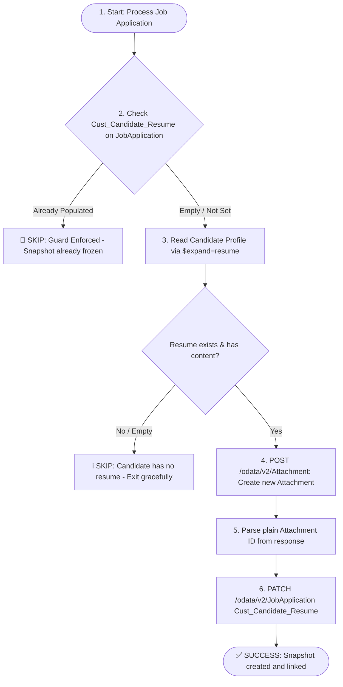

# SF_Resume_Move: SAP SuccessFactors Recruiting — Candidate Resume Snapshot to Job Application

[](https://www.python.org/downloads/)
[](https://www.odata.org/documentation/odata-version-2-0/)
[]()

Production-grade integration for **SAP SuccessFactors Recruiting** that copies a candidate's resume from their Candidate Profile to a custom attachment field on their Job Application at the moment the application is processed, enforcing an immutable **write-once snapshot**.

---

## Business Rule (Non-Negotiable)

The `Cust_Candidate_Resume` field on a `JobApplication` is **write-once**:
- **If empty** $\rightarrow$ Populate with the resume currently on the Candidate Profile at the moment of processing.
- **If already populated** $\rightarrow$ **Never modify or overwrite it**, preserving the historical audit trail even if the candidate later updates their profile resume.
- **Floating Pointer vs. Frozen Snapshot**: The Candidate Profile's `resume` is a dynamic, floating pointer (always latest), whereas each Job Application's `Cust_Candidate_Resume` is a frozen snapshot taken at first-processing time.

---

## Entity & Field Mapping

| Entity | Field | Role | Type | Description |
|---|---|---|---|---|
| `Candidate` | `resume` | Source | Standard Navigation Property | Current resume uploaded on candidate profile |
| `JobApplication` | `Cust_Candidate_Resume` | Target | Custom Attachment Field / Nav | Immutable snapshot linked to the job application |
| `Attachment` | `fileContent` / `attachmentContent` | Entity | OData Attachment Object | Cloned independent attachment created via API |

---

## Process Architecture



---

## Test Case Reference

| Parameter | Value |
|---|---|
| **Candidate ID** | `1104827` (`kavitap@yopmail.com`) |
| **Job Requisition ID** | `28997` |
| **Job Application ID** | `547901` |
| **Environment** | `https://api44preview.sapsf.com` |
| **Source Field** | `Candidate.resume` |
| **Target Field** | `JobApplication.Cust_Candidate_Resume` |

---

## Setup & Configuration

### 1. Prerequisites & Installation
Clone the repository and install required dependencies:
```bash
git clone https://github.com/vanshaj8/SF_Resume_Move.git
cd SF_Resume_Move
pip install -r requirements.txt
```

### 2. Configure Credentials (`.env`)
Create a `.env` file in the project root by copying the template:
```bash
cp .env.example .env
```

Edit `.env` with your SuccessFactors tenant credentials:
```env
SF_API_BASE_URL=https://api44preview.sapsf.com
SF_COMPANY_ID=your_company_id
SF_USERNAME=your_api_username
SF_PASSWORD=your_api_password
```

> **What is Company ID?**  
> The Company ID (or Tenant ID) is your instance identifier in SuccessFactors (e.g. `ACE_PREVIEW` or `SFCPART012345`). In Basic Auth, SuccessFactors requires the format `username@companyId`. You can find this in your browser URL (`?company=...`) when logged into SuccessFactors.

---

## How to Run the Code

### 1. Run with the Default Test Case
Executes the guarded snapshot copy for Candidate `1104827` and Job Application `547901`:
```bash
python3 main.py
```

### 2. Run for Any Specific Candidate & Application Pair
```bash
python3 main.py --candidate-id 1104827 --application-id 547901
```

### 3. Run with Full Debug Logs
Shows full HTTP request URLs, parameters, payloads, and response bodies:
```bash
python3 main.py --debug
```

### 4. Inspect Live Instance `$metadata` Schema
Validates the Attachment binary field names (`fileContent` vs `attachmentContent`) and the presence of `Cust_Candidate_Resume` against your live tenant:
```bash
python3 main.py --inspect-metadata
```

### 5. Run Automated Unit & Integration Tests (Offline / Mocked)
Executes all 14 unit and integration tests without needing active credentials:
```bash
pytest test_integration.py -v
```

---

## Using as a Reusable Python Module

You can import the functions directly into any custom script or batch processor:

```python
from sf_client import orchestrate_resume_snapshot, SFClient

# Initialize client (picks up .env or parameters)
client = SFClient()

# Execute guarded copy for a single candidate/application pair
result = orchestrate_resume_snapshot(
    candidate_id="1104827",
    app_id="547901",
    client=client
)

print(result)
# Expected Success Output:
# {
#   "status": "SUCCESS",
#   "message": "Successfully captured resume snapshot from Candidate 1104827 and linked Attachment 12345 to JobApplication 547901.",
#   "application_id": "547901",
#   "candidate_id": "1104827",
#   "attachment_id": "12345",
#   "filename": "Snapshot_App_547901_resume.pdf"
# }
```

### Core Functions in `sf_client.py`

| Function | Signature | Description |
|---|---|---|
| `get_candidate_resume` | `(candidate_id, client=None) -> dict \| None` | Queries Candidate with `$expand=resume`. Returns Base64 content or `None` if missing. |
| `get_application_snapshot_status` | `(app_id, client=None) -> dict` | Checks if `Cust_Candidate_Resume` is already populated to enforce the write-once guard. |
| `upload_attachment` | `(base64_content, filename, module="RECRUITING", client=None) -> str` | Creates a new independent `Attachment` entity and returns the parsed plain ID. |
| `update_application_snapshot` | `(app_id, attachment_id, client=None) -> dict` | Links the attachment ID to `JobApplication.Cust_Candidate_Resume` via `PATCH`/`MERGE`/`upsert`. |
| `orchestrate_resume_snapshot` | `(candidate_id, app_id, client=None) -> dict` | Orchestrates the end-to-end guarded copy flow. |
| `parse_attachment_id` | `(raw_response_or_key) -> str` | Extracts clean ID from OData URIs (`Attachment(12345L)`), JSON objects, or headers. |

---

## Project Structure

```
SF_Resume_Move/
├── config.py             # Configuration & environment variable manager
├── sf_client.py          # OData client, reusable integration functions, and guard logic
├── main.py               # CLI runner and driver script
├── test_integration.py   # Automated pytest suite (14 test cases)
├── requirements.txt      # Python dependencies
├── .env.example          # Template for credentials
├── .gitignore            # Git rules preventing credential leaks
└── README.md             # Complete documentation
```
